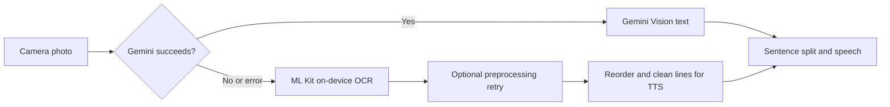

# TextVision — Document reader for blind users

**TextVision** is a cross-platform **Flutter** application for **blind and low-vision** users. It uses the device **camera** to capture printed (and some handwritten) material, **extracts text** through a **hybrid** recognition stack, and **reads the result aloud** using the phone’s built-in voices—designed with **accessibility**, **haptics**, and **screen-reader** use in mind.

It is especially relevant in **assessment contexts**: many **visually impaired students** still depend on a **human reader** sitting beside them for the whole exam to **read each question aloud**. TextVision aims to **reduce that dependency** by letting the **device** read the paper on demand, while schools and exam boards remain responsible for **official accommodations** and rules about technology in the hall.

---

## Contents

- [Who it is for](#who-it-is-for)
- [What the app does (at a glance)](#what-the-app-does-at-a-glance)
- [How recognition works](#how-recognition-works)
- [Features](#features-as-implemented)
- [Privacy and security](#privacy-and-security)
- [Requirements and prerequisites](#requirements-and-prerequisites)
- [Installation and first run](#installation-and-first-run)
- [Configuration (optional Gemini key)](#configuration-optional-gemini-key)
- [Day-to-day usage](#day-to-day-usage)
- [Permissions](#permissions)
- [Architecture (logical layout)](#architecture-logical-layout)
- [Main dependencies](#main-dependencies)
- [Testing](#testing)
- [Release builds](#release-builds)
- [Troubleshooting](#troubleshooting)
- [Known limitations](#known-limitations)
- [Contributing](#contributing)
- [License](#license)
- [Acknowledgments](#acknowledgments)

---

## Who it is for

- **Blind and low-vision** users who need **spoken access** to **paper documents**, forms, notices, or **exam papers**
- Educators or assistive-tech teams evaluating a **camera-based OCR + TTS** pipeline on **students’ own phones**
- Developers extending the same codebase

---

## What the app does (at a glance)

| Goal | Behaviour |
|------|-----------|
| Capture | Opens to a **live camera**; user takes **one photo** per capture action for a fast feedback loop |
| Recognize | Tries **cloud vision (Gemini)** when configured; otherwise or on failure uses **offline Google ML Kit** |
| Normalize | Offline path **sorts OCR lines by position** and cleans text so it sounds more natural when spoken |
| Speak | Reads in **sentence-sized chunks** with **pause**, **resume**, and **sentence-style navigation** |
| Accessible UI | Larger targets, semantics, guarded text scaling, haptics and status cues |

---

## How recognition works

High-level pipeline:



*(“Gemini succeeds” means a valid key and a successful cloud response.)*

- **Gemini path:** Sends the image over the network; best for hard layouts or messy handwriting **when allowed and available**.  
- **ML Kit path:** Runs **locally**; no cloud round-trip for OCR itself—strong for **privacy** and **offline** rooms.  

The app announces a **fallback to offline mode** when the cloud step fails so the listener is never left guessing.

---

## Features (as implemented)

### Camera and capture

- Live preview, single-tap capture, **haptic feedback** when the shutter fires  
- **Alignment monitoring** and **spoken / on-screen status** so users know whether the framing is plausible  
- **Orientation support** locked to sensible device rotations for scanning  

### Text extraction (hybrid)

1. **Gemini Vision** — Preferred when **API credentials** exist and **network** is reachable.  
2. **Google ML Kit** — Automatic **fallback**, always available after a failed Gemini attempt **or** whenever Gemini cannot start. Processing stays **on-device**.  

Post-OCR processing **merges lines** using geometry from the OCR engine so paragraphs read **top-to-bottom, left-to-right** instead of arbitrary block order.

### Text-to-speech

- **`flutter_tts`** driving the OS **native TTS** engine (quality and voices depend on the device)  
- **Sentence-at-a-time** playback with hooks for **pause / resume / forward-style navigation** on the primary screen  
- **iOS audio session** tuned so narration can coexist with camera-related audio routing where Apple allows  

### Accessibility

- **Semantics** suited to **VoiceOver / TalkBack**  
- Elevated minimum **tap targets** in the Material theme  
- **Text scaler clamp** so extreme system font scaling does not shred layout  
- **Centralized accessibility helpers** (e.g., haptics and announcement-oriented patterns)  

---

## Privacy and security

- **Offline path:** Camera frames used for OCR are handled by **on-device ML Kit**; recognition does not require transmitting the page to Google’s vision API for OCR *when ML Kit succeeds alone*. *(ML Kit libraries themselves are governed by Google’s terms—which you accept when integrating the SDK—so review those for institution compliance.)*
- **Online path:** If **Gemini** is enabled, **image content is sent** to Google’s servers for that API call. Treat this as **sensitive** in exam scenarios: **inform participants**, comply with **data processing rules**, and prefer **exam-board-approved** setups.
- **API keys:** Never commit **`GEMINI_API_KEY`** into version control. Prefer **`--dart-define`** or CI secrets for builds; `.env` is for **local convenience** only. For production, a **backend proxy** is the safest pattern—the app as shipped demonstrates direct API use for simplicity, not maximal enterprise hardening.

---

## Requirements and prerequisites

**Runtime**

- Target **Flutter SDK 3.9.0 or newer** and the **Dart SDK** bundled with that Flutter release  
- **Android:** Aim for broad compatibility; permissions and behaviour differ across OS generations—**always validate on the exact devices students will use**  
- **iOS 12 or later**  
- **Physical handset with a camera** strongly recommended  

**Development machine**

- Flutter SDK correctly installed (**`flutter doctor` should be clean enough** to compile for your target platforms)  
- **Android Studio** / Android SDK **or** **Xcode** (for respectively Android-only or iOS-only work; both for dual-platform builds)  

---

## Installation and first run

```bash
git clone <repository-url>
cd textvision
flutter pub get
flutter run
```

- Use a **physical device** for realistic camera OCR tests.  
- After changing **native plugins** (camera, OCR, TTS), do a **full rebuild** (`flutter clean` then rebuild)—see [Troubleshooting](#troubleshooting).  

---

## Configuration (optional Gemini key)

To enable **online** extraction first:

**Option A — local `.env`** (stay in the same directory you invoke Flutter from)

Create **`GEMINI_API_KEY=YOUR_KEY_HERE`** on one line inside a file named **`.env`** at project root.

Keys: [Google AI Studio](https://aistudio.google.com/app/apikey) or Google Cloud → APIs & Services → Credentials.

**Option B — no file secret**

```bash
flutter run --dart-define=GEMINI_API_KEY=YOUR_KEY_HERE
```

Use analogous **`--dart-define`** flags for **`flutter build`**.

If Gemini is missing or errors, behaviour **drops back to offline ML Kit** and the UI typically signals **offline mode**.

---

## Day-to-day usage

1. **Open** TextVision → camera activates.  
2. **Approve** camera access.  
3. **Frame** the page; listen or feel for positioning hints.  
4. **Tap capture** → short processing cue → extracted text reads aloud.  
5. Use **speech controls** to **pause**, **resume**, or **step through sentences** as the UI exposes.  

For dense papers, repeated **section-by-section** captures usually beat one ultra-wide blurry shot—users learn to treat each capture like asking a reader for “start from Question 8.”  

---

## Permissions

| Capability | Purpose |
|------------|---------|
| **Camera** | Required for scans |
| **Storage / Photos** | May appear for reading or persisting intermediates depending on OS and plugin behaviour |
| **Microphone** (declared) | Reserved for potential future speech features; core flow is **not** microphone-driven dictation |

---

## Architecture (logical layout)

Rather than splitting into many unrelated screens, the shipped experience keeps **capture and playback** cohesive:

- **Single primary screen:** camera UX, hybrid processing trigger, transcript playback affordances  
- **Service-style modules:** camera wrapper, ML Kit OCR, optional Gemini HTTP client, image preprocessing fallback, blind-friendly text ordering, hybrid TTS, permission gate, accessibility utilities  
- **Supplementary parsers** (questions / grouping) exist in source for experimentation but **are not wired** into the dominant user flow today  

Multi-platform scaffolding (Android / iOS / desktop / web folders) mirrors standard **Flutter templates**—mobile is the realistic target for OCR + flash photography.

---

## Main dependencies

| Concern | Technology |
|---------|------------|
| Camera | **`camera`** |
| OCR | **`google_mlkit_text_recognition`** |
| Vision API | Gemini over **`http`**; optional **`flutter_dotenv`** for local keys |
| Speech | **`flutter_tts`** |
| Images | **`image`** |
| Permissions | **`permission_handler`** |

Other declared packages (**`shared_preferences`**, **`path_provider`**, **`image_picker`**, etc.) anticipate future features—they are **not** critical to the minimalist camera → recognize → speak path.

---

## Testing

```bash
flutter test
```

Widget and service checks validate selected logic; **end-to-end quality** still depends on **real hardware** scans under varied lighting.

---

## Release builds

**Android APK**

```bash
flutter build apk --release
```

**Apple device / store pipeline**

```bash
flutter build ios --release
```

Release signing, provisioning profiles, Play Console listings, and **App Privacy** questionnaires are outside this README—you must satisfy **store policies** separately, especially regarding **photos** and **optional cloud uploads**.

---

## Troubleshooting

| Symptom | Things to try |
|---------|----------------|
| OCR always empty | Better light, sharper focus; move closer but keep full line in frame; retry after **`flutter clean` + reinstall** |
| Gemini never succeeds | Confirm key via **`--dart-define`** or `.env`; check network/VPN/firewall |
| Fallback works but wording order is odd | Complex columns or sideways text confuse any engine—rotate paper to portrait upright where possible |
| No speech | Device volume/unmute; verify OS TTS not disabled in system settings |
| Crash after plugin upgrade | **`flutter clean`**, **`flutter pub get`**, full rebuild—not hot reload |
| iOS CocoaPods friction | Standard Flutter fix: reinstall pods for the Flutter iOS host workspace, reopen Xcode |

---

## Known limitations

1. **Exams regulation:** Institutions define **whether phones and cloud APIs are allowed**. This software does not replace formal **exam access arrangements**.  
2. **Diagrams, chemistry, handwritten scratch:** OCR and vision APIs read **symbols** inconsistently—not every STEM layout is faithfully spoken.  
3. **Accent / voice packs:** Speech quality hinges on OS-installed voices.  
4. **Temporal behaviour:** Pause/resume edge cases vary by manufacturer Android builds.  
5. **Developer trap:** Speech can be **disabled globally in debug** through a guarded hook in Dart startup code meant only when hunting native regressions—not for end users.  

---

## Contributing

Improvements welcome. Explain **motivation**, **risk**, **test plan** (device types, accessibility tools used), and any **exam-privacy implication** before large behavioural changes.

## License

This project is licensed under the **MIT License**.

## Acknowledgments

- **Google ML Kit** for on-device OCR  
- **`flutter_tts`** contributors  
- **Flutter** and **Dart** communities  
